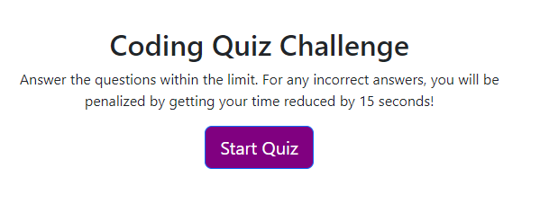
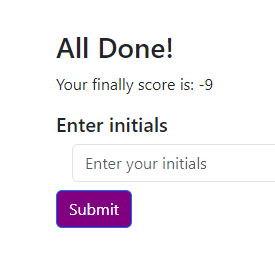

# Code Quiz
## Description
This app is timed coding quiz with multiple-choice questions. This app will run in the browser, and will feature dynamically updated HTML and CSS powered by JavaScript code that you write.

## Table of Contents

- [Usage](#usage)
- [Links](#Links)
- [Credits](#credits)
- [License](#license)
- [Contact](#Contact)

## Usage
AS A coding boot camp student
I WANT to take a timed quiz on JavaScript fundamentals that stores high scores
SO THAT I can gauge my progress compared to my peers

GIVEN I am taking a code quiz
WHEN I click the start button
THEN a timer starts and I am presented with a question

WHEN I answer a question
THEN I am presented with another question
WHEN I answer a question incorrectly
THEN time is subtracted from the clock
WHEN all questions are answered or the timer reaches 0
THEN the game is over

WHEN the game is over
THEN I can save my initials and score

## Links

## Credits
Credit to my tutor. She has been helpful in helping me understand many of the complex topics. My instructor for teaching it to us and Google/Stackoverflow when I got errors I was able to troubleshoot.
## License
 [https://choosealicense.com/](https://choosealicense.com/).
${renderLicenseLink (data.license)} 
🏆 The previous sections are the bare minimum, and your project will ultimately determine the content of this document. You might also want to consider adding the following sections.
## Badges
${renderLicenseBadge (data.license)}

## Contact
mariayaslinskiy@gmail.com
YaslinskiyM Github